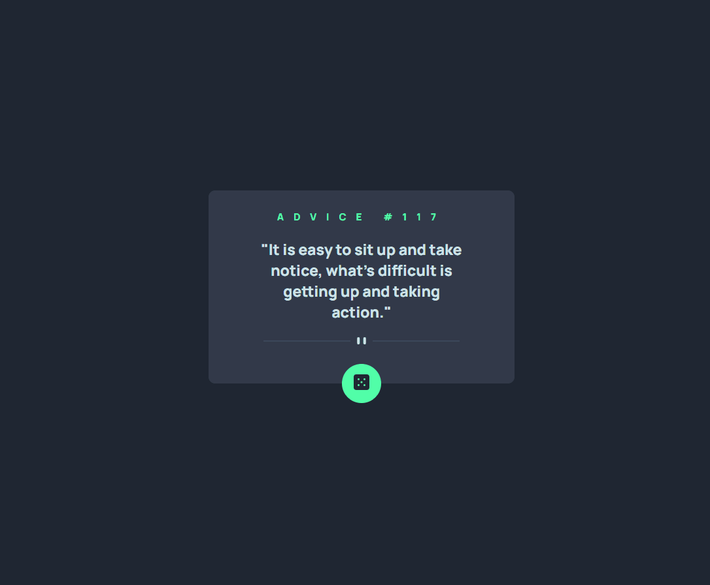

# Projeto Frontend Mentor - Advice generator app
Exercício realizado como desafio lançado pelo curso DevQuest 🚀

## Tecnologias utilizadas
- HTML
- CSS

-----------------------------------------------

### Coisas que **aprendi**:
1. colocar imagem no HTML com outro tamanho para telas menores, sem necessidade de usar media queries;
2. inserir uma forma geométrica somente com CSS;
3. animações de sombra;
4. posicionamento de um elemento centralizado em outro.

-----------------------------------------------

### **Dificuldades** enfrentadas
* centralizar um elemento dentro de outro de modo que acompanhe no responsivo.

-----------------------------------------------
### Autor
- Execução do projeto - [Karolline Uchôa](https://github.com/KarollineUchoa) 
- Desafio Profile card component solution - [Frontend Mentor](https://www.frontendmentor.io/challenges/advice-generator-app-QdUG-13db/hub/advice-generator-app-cQJvnpV9Qm)